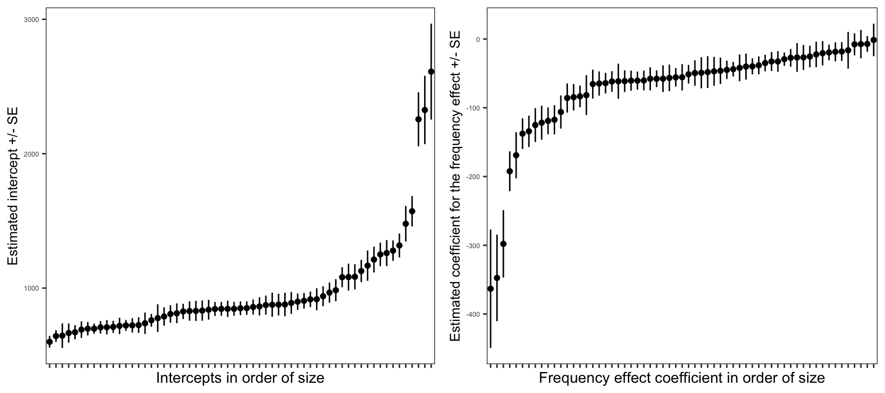
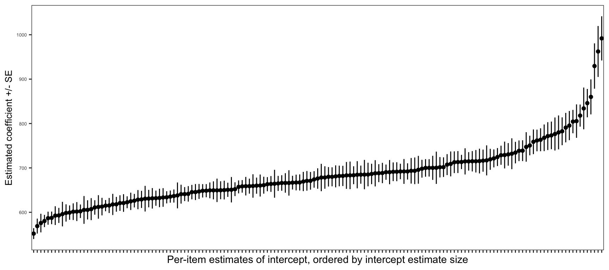
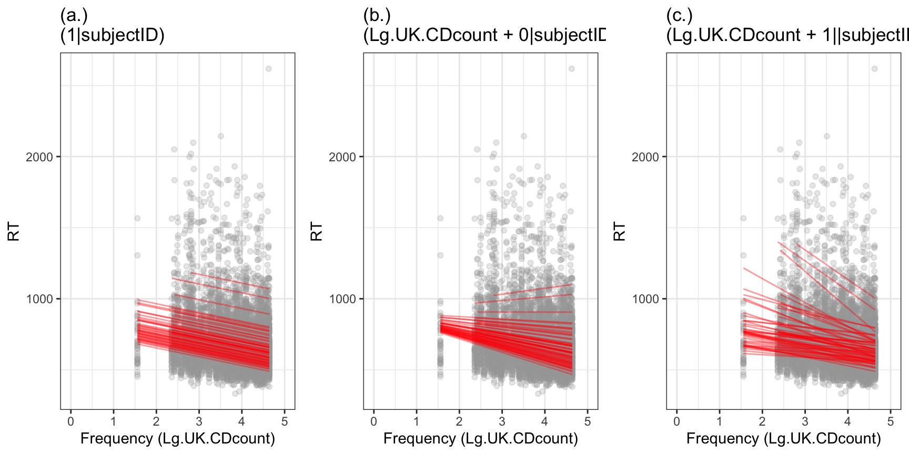

---
output:
  html_document: default
  pdf_document: default
---


```
## Loading required package: Matrix
```

```
## ── Attaching packages ─────────────────────────────────────── tidyverse 1.3.1 ──
```

```
## ✓ ggplot2 3.3.5     ✓ purrr   0.3.4
## ✓ tibble  3.1.2     ✓ dplyr   1.0.7
## ✓ tidyr   1.1.3     ✓ stringr 1.4.0
## ✓ readr   1.4.0     ✓ forcats 0.5.1
```

```
## ── Conflicts ────────────────────────────────────────── tidyverse_conflicts() ──
## x dplyr::combine() masks gridExtra::combine()
## x tidyr::expand()  masks Matrix::expand()
## x dplyr::filter()  masks stats::filter()
## x dplyr::lag()     masks stats::lag()
## x tidyr::pack()    masks Matrix::pack()
## x tidyr::unpack()  masks Matrix::unpack()
```


> Rob Davies

# PSYC402 Part 2 Week 18

## Welcome

Welcome to our overview of the materials and guidance you will work with in **PSYC402 Week 18** for the **02-mixed** class.

This week, we again look at data with multilevel structure.
But we now look at data where participants were asked to respond to a set of stimuli (words) so that our observations consist of recordings of the response made by each participant to each stimulus.
We use the same analysis procedure that we used for multilevel data: with one significant change which we shall identify and explain.

In this webpage, I extract and present an outline taster summary (a little re-ordered) of a second chapter written for the course.
Please go to the chapter for the authoritative version of the full text: [02-mixed.pdf](files/week-18/02-mixed.pdf).

### Introductory discussion

Many psychological studies involve scenarios in which the researcher samples both participants and some kind of stimulus (e.g., words, pictures, sounds, stories ...)
Often, the researcher will present the stimuli to the participants for response in some version of a range of possible designs: 

- all participants see and respond to all stimuli; 
- participants respond to different sub-sets of stimuli in different conditions (or in different groups) but they see and respond to all stimuli in a sub-set; 
- participants are allocated to respond to stimulus sub-sets according to a counter balancing scheme (e.g., through the use of Latin squares).

We are talking, here, about **repeated-measures designs** where the experimenter presents a sample of multiple stimuli for response to each participant in a sample of multiple participants.

Whatever version of this scenario, *if* participants are responding to multiple stimuli and *if* multiple participants respond to each stimulus, then the data will have a *multilevel structure* such that each observation can be grouped both by participant and by stimulus.
We could say that observations of the responses made by participants to each stimulus can be grouped by participant: each person will tend to respond in similar ways to different stimuli; and we will see differences between participants.
Or, we could say that observations of responses can be grouped by stimulus because each stimulus will tend to evoke similar kinds of responses in different people; and we will see differences between the responses made to different stimuli.
The differences between the sets (or groups) of responses made by different participants (between participants differences) and the differences between the sets of responses made to different stimuli (between stimulus differences) may be unexplained or random differences.

**The multilevel structure requires that we use multilevel or mixed-effects models to analyse our data.**
We are going to learn about an approach in which we take into account the unexplained or random differences between participants *and* between stimuli.
A substantial portion of our conceptual development will now begin, with a deepening in our perspective on the impact of random differences between participants or stimuli, which we shall discuss in terms of *random effects*.
We shall extend our practical skills by learning how to specify these random effects in different ways using the `lmer()` function.

We will learn to fit models that can effectively handle the fact that we may observe responses from participants who not only differ in their average level of performance (differ in intercepts, if we control for the effects of covariates) but differ also in their response to experimental variables (differ in slopes).
Our work, here, will build on the work we did in the previous class.
Figure \@ref(fig:freqperchildlm) presents estimates of the intercept and the effect of an experimental variable (word frequency) for each participant in our example dataset, with plot points shown ordered by the size of the estimate.

<div class="figure">

<p class="caption">(\#fig:freqperchildlm)Estimated intercepts and frequency effect slopes (with SEs) calculated for each child analysed separately, with point estimates presented in order of size</p>
</div>

We will learn to fit models that can *also* handle the fact that, as is often true in psychological research, we may observe responses that are made to stimuli which will present random differences as well (in relative difficulty, say).
For example, some words elicit slower and some elicit faster responses on average (Figure \@ref(fig:pitemsints)).

<div class="figure">

<p class="caption">(\#fig:pitemsints)Estimated intercepts (with SEs) calculated for each stimulus word, with coefficients ordered by average latency for each word</p>
</div>

In a further extension of our understanding, located especially in the chapter reading, we will develop our conceptual grasp of multilevel or mixed effects models by considering carefully what we estimate when we estimate random effects.
We will discuss the ways in which the random effects structure of multilevel or mixed-effects models can vary, and what impact that variation may have, as illustrated in Figure \@ref(fig:indiv-prediction).

<div class="figure">

<p class="caption">(\#fig:indiv-prediction)Plot showing model predictions of the effect, for each individual, of word frequency on reading reaction time -- predictions vary between models incorporating (a.) random effect of participants on intercepts only; (b.) random effect of participants on slopes only and (c.) random effect of participants on intercepts and on slopes</p>
</div>

### Critical idea

The critical idea is that, in general, in experimental psychological science, when we do data analysis, *if* we want to estimate effects of experimental variables more accurately *then* our models need to incorporate terms to capture the impact on observed outcomes of variation among sampled participants and among sampled stimuli.
Historically, we have, as a field, learned that we must take these sampling effects into account.
More and more commonly, we are learning to use multilevel or mixed-effects models to do this.

### Targets

Our learning objectives include the development of key concepts and skills.

- **concepts** --	begin to develop an understanding of crossed random effects of subjects and stimuli
- **skills** -- practice how to tidy experimental data for mixed-effects analysis
- **skills** -- practice fitting linear mixed-effects models incorporating random effects of subjects and stimuli

Our aim is to build on our development of understanding and skills.
The critical extension, here, is to take the perspective in which we are not just grouping observations under only one kind of grouping (e.g., children's scores, grouped by class) but are working with analyses which allow us to take into account the fact that we have data -- as happens for many studies -- where observations are structured both by participants and by stimuli.

## Resources for you

You will see -- below -- links to the lectures, information about the data we will analyze, and an explanation of the activities.

The links and everything you need for your practical work class can *also* be found in the **Week 18 files** folder on Moodle, here:

[Link to Moodle](https://modules.lancaster.ac.uk/course/view.php?id=34085#section-12){target="_blank"}

I have prepared materials that I suggest you use in this order:

- **Before the lab session**

1. Take a look at the lecture slides, watch the lecture video. The lecture is designed to work *only* as an outline summary of the materials. Learning will work best if you read the book chapter I wrote on the topic, and work through the exercises in the workbook.R
2. Read the book chapter, to develop understanding.
2. Download the week 18 files, and work your way throught the workbook.R, guided by the book chapter, at least as far as reading in the data and tidying it for analysis.

- **In the session**

3. Work through the workbook.R, complete the tasks and answer the questions, in groups, guided by the code tips and the information in the chapter.

- **After the session**

4. Bring your questions to the Q&A session or post questions to the discussion forum.

Be patient with yourself and with the materials. The topic is challenging because it is new but it is very important. The plan is to build up understanding and analysis skill step by step.

### Lectures: video recordings

The lecture material for this week is presented in three parts.
Click on a link and your browser should open a tab showing the *Panopto* video for the lecture part.
(You will need to be on campus or logged in to the university VPN to get access to the videos.)

[Part 1 of 3](https://dtu-panopto.lancs.ac.uk/Panopto/Pages/Viewer.aspx?id=2fa60b12-2eca-4412-8672-acd60104da1d){target="_blank"}

[Part 2 of 3](https://dtu-panopto.lancs.ac.uk/Panopto/Pages/Viewer.aspx?id=7f31cef0-1e39-4712-b2a1-acd601195c78){target="_blank"}

[Part 3 of 3](https://dtu-panopto.lancs.ac.uk/Panopto/Pages/Viewer.aspx?id=58ab0c0c-37be-491f-a9e5-acd6011c38dd){target="_blank"}

### Book chapter

I wrote a book chapter to support PSYC402 student learning.

You can download the chapter here [02-mixed.pdf](files/week-18/02-mixed.pdf).

The chapter is useful to you in two ways:

1. I use text and visualization to explain the core ideas in depth;
2. I take you through each part of the code that you need to use, step-by-step, for your development of practical skills in data tidying, visualization, and analysis.


### Pre-lab activity 1: Get your files ready for the lab class

Activities in the class that goes with this chapter are associated with the following data files:

- `CP study word naming rt 180211.dat`
- `CP study word naming acc 180211.dat`
- `words.items.5 120714 150916.csv`
- `all.subjects 110614-050316-290518.csv`

And the .R code file:

- `402-02-mixed-effects-workbook.R`

A pre-tidied version of the CP study data is available as:

- `long.all.noNAs.csv`

You will use `402-02-mixed-effects-workbook.R` in the lab activity.

### Lab activity

We will take things step-by-step.
We will split .R scripts into parts, tasks and questions:  

- different parts for different phases of the analysis workflow;
- different tasks for different steps in each phase;
- different questions to examine different ideas or coding steps.

### Tasks

In the activity, we are going to work through the following tasks.

First, I am going to show you **how to put together, tidy, and prepare** for analysis the kind of data you can expect to record or receive when you do a psychological experiment.
You can skip the tasks in this part but checking the steps out will save you a lot of time if you are going to work with primary or original (i.e. raw and thus messy) data in your dissertation or in your future professional work.

1. Load the libraries we need
2. Read in the data files we will be using -- using variants of the `read_()` function
3. Restructure behavioural (response) data -- using `pivot_longer()`
4. Join data from different sources -- using `full_join()`
5. Select just the variables you need -- using `select()`
6. Filter observations by setting different kinds of conditions -- using `filter()`
7. Remove missing values -- using `na.omit()`
8. Produce an Excel-readable and shareable version of the tidied *prepared* dataset -- using `write_csv()`

Second, we work on our understanding and practical skills in modeling multilevel structured data.
This part *is* essential to your attainment of our learning objectives.

9. Read in the pre-prepared data -- using `read_csv()` and defining `col_types` as we do so
10. Visualizing effects with scatterplots -- using `geom_point()` and `geom_smooth()`
11. Modeling effects while ignoring grouping -- using `lm()`
12. Visualizing how effects may differ between groups (here, between participants) -- using `facet_wrap()`
13. Fitting linear mixed-effects models -- using `lmer()`
14. Learning to fit mixed-effects models with different kinds of random effects structure, examining the impact of these differences in structure
15. Taking into account random effects associated with differences between participants, as well as differences between stimuli

In the answers version of the workbook, I will provide optional extension exercises you can use to develop your coding skills, showing how I produced the plots in the slides and the book chapter.

### The data we will work with: CP reading study

This week, we will be working with the **CP reading study** dataset.
CP tested 62 children (aged 116-151 months) on reading aloud in English.
In the experimental reading task, she presented 160 words as stimuli.
The same 160 words were presented to all children.
The words were presented one at a time on a computer screen.
Each time a word was shown, the children had to read the word out loud and their response was recorded.
Thus, the CP reading study dataset comprised observations about the responses made by 62 children to 160 words.

Ultimately, the CP dataset were incorporated in an analysis of the impact of age on reading skills over the life-span, reported by Davies, Arnell, Birchenough, Grimmond and Houlson (2017).
You can find more details on the data and the methods in the book chapter associated with this class, and in that paper.

## References

Davies, R. A., Arnell, R., Birchenough, J. M., Grimmond, D., \& Houlson, S. (2017). Reading through the life span: Individual differences in psycholinguistic effects. *Journal of Experimental Psychology: Learning, Memory, and Cognition*, 43, 1298.
