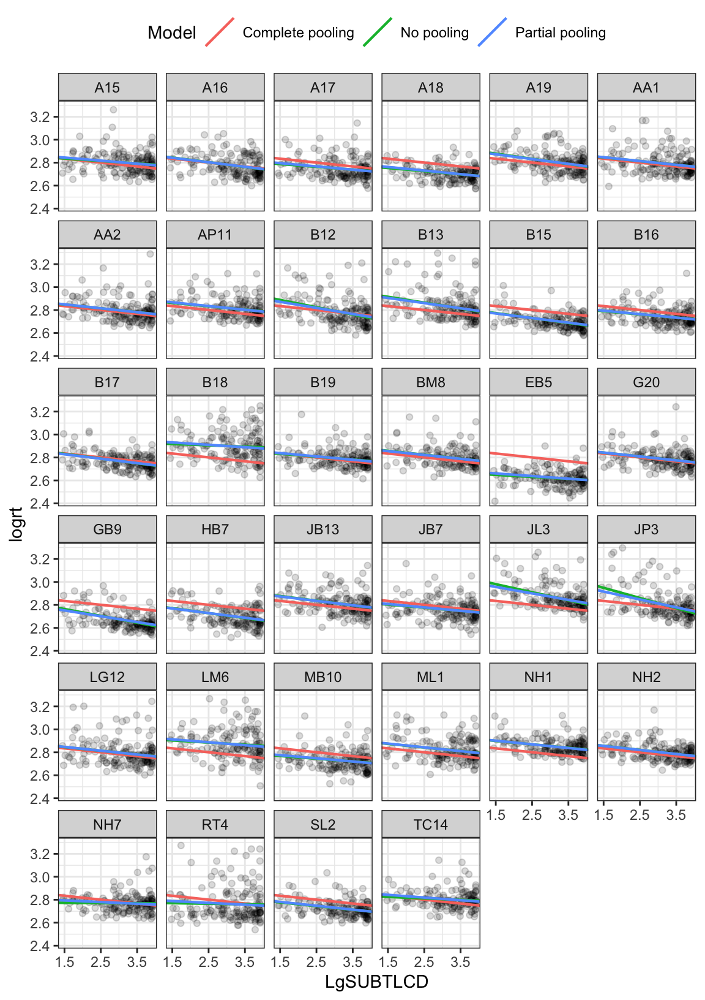

---
output:
  html_document: default
  pdf_document: default
---


```
## Loading required package: Matrix
```

```
## ── Attaching packages ─────────────────────────────────────── tidyverse 1.3.1 ──
```

```
## ✓ ggplot2 3.3.5     ✓ purrr   0.3.4
## ✓ tibble  3.1.2     ✓ dplyr   1.0.7
## ✓ tidyr   1.1.3     ✓ stringr 1.4.0
## ✓ readr   1.4.0     ✓ forcats 0.5.1
```

```
## ── Conflicts ────────────────────────────────────────── tidyverse_conflicts() ──
## x dplyr::combine() masks gridExtra::combine()
## x tidyr::expand()  masks Matrix::expand()
## x dplyr::filter()  masks stats::filter()
## x dplyr::lag()     masks stats::lag()
## x tidyr::pack()    masks Matrix::pack()
## x tidyr::unpack()  masks Matrix::unpack()
```


```
## 
## ── Column specification ────────────────────────────────────────────────────────
## cols(
##   .default = col_double(),
##   subjectID = col_character(),
##   Test = col_character(),
##   Gender = col_character(),
##   Subject = col_character(),
##   item_name = col_character(),
##   item_type = col_character(),
##   SUBTLWF = col_number()
## )
## ℹ Use `spec()` for the full column specifications.
```

> Rob Davies

# PSYC402 Part 2 Week 19

## Welcome

Welcome to our overview of the materials and guidance you will work with in **PSYC402 Week 19** for the **03-mixed** class.

As we saw in the **Introduction to mixed-effects models** (for the `02-mixed` class), many Psychologists conduct studies where it is not sensible to think of observations as being nested (Baayen, Davidson, \& Bates, 2008). 
We shall work with the **ML word recognition study** dataset, which has a structure similar to the CP study data that we worked with previously.
Again, the core concern is that the data come from a study with a **repeated-measures design** where the experimenter presented multiple stimuli for response to each participant, for several participants, so that we have multiple observations for each participant and multiple observations for each stimulus.
Getting practice with this kind of data will help you to easily recognize what you have got when you see it in your own work.

We shall analyse the outcome variable in relation to:

\begin{description}
\item[fixed effects]
the impact of independent variables like participant reading skill or word frequency
\item[random effects]
the impact of random or unexplained differences between participants and also between stimuli
\end{description}

In this webpage, I extract and present an outline taster summary (a little re-ordered) of a second chapter written for the course.
Please go to the chapter for the authoritative version of the full text: [03-mixed.pdf](files/week-19/03-mixed.pdf).

### Introductory discussion

We are going to respond to the multilevel (or crossed random effects) structure in the data by using linear mixed-effects models to analyze the data.
This week, we are going to look at what mixed-effects models do from a **new perspective**.

Our concern will be with different ways of thinking about why mixed-effects models are superior to linear models where data have a multilevel structure.
Mixed-effects models tend to be more accurate in this (very common) situation because of what is called *partial pooling* and *shrinkage* or *regularization*.
We use our practical example to explore these ideas.

Figure \@ref(fig:no-vs-complete-vs-partial) presents a grid or trellis of plots, one plot per person.
To draw the plot, I adapted code written by TJ Mahr:

<https://www.tjmahr.com/plotting-partial-pooling-in-mixed-effects-models/>

In each plot, you can see points corresponding to the RT of each response made by a participant to a stimulus word.
In all plots, the pink line represents the *complete pooling* data model estimate of the effect of frequency on response RTs.
In each plot, the green line represents the effect of frequency estimated using just the data for each participant, the *no pooling* estimates.
In the plots, we also see blue lines that represent the mixed-effects model *partial pooling* estimates.

<div class="figure">

<p class="caption">(\#fig:no-vs-complete-vs-partial)Plot showing the relationship between logRT and log frequency (LgSUBTLCD) separately for each participant; pink line shows the complete pooling estimate green line shows the no-pooling estimate; and blue line shows the linear mixed-effects model partial pooling estimate</p>
</div>

### Critical idea

**Shrinkage or regularization** means that models of data should be excited by the data but not *too* excited.

### Targets

We are probably now at a stage, in the development of our skills and understanding, where we can be more specific about our targets for learning.
We have three components of the capacity we seek to develop.
These components include the capacity to understand mixed-effects models, the capacity to work with them practically in R, and the capacity to present the results.

The development of skills and understanding in relation to each component will travel at different speeds, for different people, and, within any person, at different speeds for different components.
We have *already* begun to develop some of the capacities I outline.
We will strengthen our understanding and our practical skills in the class for which this webpage, and the associated resources, are provided.
And we will will continue to develop both understanding and skills in the next class.

Remember, my advice has been that we should seek to progress in our development step-by-step.
Remember, **we need to be patient with ourselves**.
Our understanding or the extent of our practical capacities will not necessarily match our own internal evaluation.
In other words, we might not be satisfied with our understanding but, still, our understanding might be satisfactory.
I want to remind you that these are challenging materials.
For these reasons, I specify what we are aiming to develop in terms of what we can *do*.

#### We want to develop the capacity to **understand** mixed-effects models

This involves the capacity to:

1. recognize where data have a multilevel structure;
2. recognize where multilevel or mixed-effects models are required;
3. distinguish the elements of a mixed-effects model, including fixed effects and random effects;
4. be able to explain how random effects can be understood in terms of random differences (or deviations), between groups or classes or individuals, in intercepts or slopes;
5. be able to explain how random effects can be understood in terms of variances, as a means to account for random differences between groups or classes or individuals in intercepts or slopes;
6. be able to explain how mixed-effects models work better than linear models, for multilevel structured data, because they take into account variances associated with random differences;
7.and be able to explain how mixed-effects models work better because they allow partial-pooling of estimates, using both information from the whole data set and information from group or class or individual specific data.

#### We want to develop the capacity to work practically in R with mixed-effects models

This involves the capacity to:

1. be able to specify a mixed-effects model in `lmer()` code;
2. be able to identify how the mixed-effects model code varies, depending on the kinds of random effects that are assumed;
3. be able to identify the elements of the output or results that come from an `lmer()` mixed-effects analysis;
4. be able to interpret the fixed-effects estimates;
5. and be able to interpret the random effects estimates, both variance and covariance estimates.

#### We want to develop the capacity to talk about and present the results of mixed-effects models

This involves the capacity to:

1. be able to describe in words and summary tables the results of a mixed-effects model;
2. be able to visualize the effects estimates from a mixed-effects model.

## Resources for you

You will see -- below -- links to the lectures, information about the data we will analyze, and an explanation of the activities.

The links and everything you need for your practical work class can *also* be found in the **Week 19** folder on Moodle, here:

[Link to Moodle](https://modules.lancaster.ac.uk/course/view.php?id=34085#section-13){target="_blank"}

I have prepared materials that I suggest you use in this order:

- **Before the lab session**

1. Take a look at the lecture slides, watch the lecture video. The lecture is designed to work *only* as an outline summary of the materials. Learning will work best if you read the book chapter I wrote on the topic, and work through the exercises in the workbook.R
2. Read the book chapter, to develop understanding.
2. Download the week 19 files, and work your way throught the workbook.R, guided by the book chapter.

- **In the session**

3. Work through the workbook.R, complete the tasks and answer the questions, in groups, guided by the code tips and the information in the chapter.

- **After the session**

4. Bring your questions to the Q&A session or post questions to the discussion forum.

Be patient with yourself and with the materials. The topic is challenging because it is new but it is very important. The plan is to build up understanding and analysis skill step by step.

### Lectures: video recordings

The lecture material for this week is presented in three parts.
Click on a link and your browser should open a tab showing the *Panopto* video for the lecture part.
(You will need to be on campus or logged in to the university VPN to get access to the videos.)

[Part 1 of 3](https://dtu-panopto.lancs.ac.uk/Panopto/Pages/Viewer.aspx?id=6ee1618c-ced2-425b-9213-ace4011ea856){target="_blank"}

[Part 2 of 3](https://dtu-panopto.lancs.ac.uk/Panopto/Pages/Viewer.aspx?id=01dccf63-8b1e-406c-8694-ace401229f10){target="_blank"}

[Part 3 of 3](https://dtu-panopto.lancs.ac.uk/Panopto/Pages/Viewer.aspx?id=ddde4efb-2975-4347-b255-ace401328b39){target="_blank"}

### Book chapter

I wrote a book chapter to support PSYC402 student learning.

You can download the chapter here [03-mixed.pdf](files/week-19/03-mixed.pdf).

The chapter is useful to you in two ways:

1. I use text and visualization to explain the core ideas in depth;
2. I take you through each part of the code that you need to use, step-by-step, for your development of practical skills in data tidying, visualization, and analysis.

### Pre-lab activity 1: Get your files ready for the lab class

Activities in the class that goes with this chapter are associated with the following data file:

- `subjects.behaviour.words-310114.csv`

And the .R code file:

- `402-03-mixed-effects-workbook.R`

You will use `402-03-mixed-effects-workbook.R` in the lab activity.

### Lab activity

We will take things step-by-step.

The workbook has three sets of steps:

- First, I show you how to prepare data for analysis -- just run the code and do the exercises;
- Second, I walk through a sequence of tasks where I show you how to fit and compare a series of models -- again, just run the code and do the exercises;
- the critical step is Step 7, where I ask you to follow the examples, running your own series of models but with your selection of variables;
- Third, finally, I show you how to reproduce some of the key plots from the book chapter and slides, this is for your information, if you are interested, and is optional.

### Tasks

In the activity, we are going to work through the following tasks.

First, I am going to show you **how to prepare data** for analysis.

1. Load the libraries we need.
2. Read in the data file -- using the `read_csv()` function.
3. Plot the distribution of reaction time (RT) observations -- using `geom_density()` and `geom_rug()`.
4. Take a look at `ggplot()` refernece information and experiment with alternative visualizations.
5. Filter observations by setting conditions on RT -- using `filter()`.
6. Check the impact of filtering by counting the number of observations -- using `length()`
7. Visualize the distribution of the filtered data.
8. Experiment to examine the impact of setting different thresholds to filter observations
9. Transform RT -- using `log10()`. 
10. Visualize the distribution of log10 transformed filtered RTs.
11. Visualize the distribution of log10 RTs for each individual -- using `facet_wrap`
`write_csv()`, as seen in Figure \@ref(fig:density-per-child).
12. Experiment with altering the visualization.
13. Examine what the distributon of RTs looks like for each stimulus item.

<div class="figure">

<p class="caption">(\#fig:density-per-child)Distribution of log10 RTs, for each participant in the ML dataset, with participant data shown using density plots, ordered by average logRT per person; the red line indicates the overall mean log RT</p>
</div>

Second, I then walk through a sequence of tasks where I show you how to fit and compare a series of models.

14. Consider a linear model of the effect of word frequency on RT, then examine the impact of other potential predictors.
15. Fit a linear mixed-effects model to estimate the effect of frequency on log RT while taking into account random effects -- using `lmer()`.
16. Fit a linear mixed-effects models with varying random effects.
17. Compare the different models -- using `anova()`.
18.-19. Examine whether random slopes effects are required.
20. Get p-values for fixed effects estimates -- using `lmerTest`.

I think the important bit for your development is located in `Step 7: run your own sequence of lmer models`

**Try to run a series of models in which the fixed effects variable is something different i.e. use a different word property, or properties.**

Third, the last section of the workbook shows you how to reproduce the plots in the chapter and slides.
This is optional, and provided for your interest, only.

To produce the plots, I adapted Tristan Mahr's code, from his very useful blogpost (borrowed, with thanks):
<https://www.tjmahr.com/plotting-partial-pooling-in-mixed-effects-models/>

### The data we will work with: ML

We will be working with the **ML word recognition study** dataset.
The focus of our interest is on the ways in which participant attributes (like age) or word properties (like frequency) influence the speed of response in a task measuring the ability to recognize visually presented English words.

ML examined visual word recognition in younger and older adults using the lexical decision task.
Lexical decision is a very popular technique for examining word recognition, especially in adults. 
While not every Psychology student will be interested in word recognition, or reading, everyone should understand that tasks like lexical decision are similar to a range of other tasks used in experimental psychological science.
The critical features of the study are that we have an outcome -- a decision response -- observed multiple times (for each stimulus) for each participant. 
We shall be analyzing the speed of response, reaction time (RT), measured in milliseconds (ms).

In the lexical decision task, participants completed a series of 320 trials.
In each trial, they were presented with a stimulus, a string of letters, that was either a real word (e.g., 'car') or a made-up or non-word (e.g., 'cas').
There were 160 word and 160 non-word stimuli.
Each stimulus was presented one at a time on a computer screen.
Participants were required to respond to the stimulus by pressing a button to indicate either that they thought the stimulus was a word (they knew) or that they thought it was a non-word.
Each sequence of events, in which a stimulus was presented and a response was recorded, is known as a *trial*.
The critical outcome measure was the reaction time of each response: the interval of time from the moment the stimulus was first presented (the stimulus onset) to the moment the response was made (the response onset).

The total number of participants for this study was 39, including a group of younger adults and a group of older adults.
Information was collected about the participants' age, education and gender.
In addition, participants were asked to complete ability measures (TOWRE sight word and phonemic tests, Torgesen et al., 1999) and a measure of reading experience (Author Recognition Test, ART, Masterson \& Hayes, 2007).

In summary, ML collected data on: lexical decision task response reaction times (RTs) and accuracy; information on lexical decision stimulus items, including variables like the length or frequency of words (values taken from the English Lexicon Project, Balota et al., 2007); and information on participants, including age, reading ability and reading experience.

The ML study data includes the following variables that we will work with (as well as some you can ignore).
More information about the study, and the research context for the study, including the research questions, can be found in the book chapter.

*Identifying variables*

* `subjectID` -- identifying code for participants
* `item_name` -- words presented as stimuli
* `item_number` -- identifying code for words presented

*Response variables*

* `RT` -- response reaction time (ms), for responses to words

*Subject variables*

* `Age` -- in years
* `Gender` -- coded M (male), F (female)
* `TOWRE_wordacc` -- word reading skill, words read correctly (out of 104)
* `TOWRE_nonwordacc` -- nonword reading skill, nonwords (made up words) read correctly (out of 63)
* `ART_HRminusFR` -- reading experience score

*Item variables*

* `Length` -- word length, in letters
* `Ortho_N` -- orthographic neighbourhood size, how many other words in English a stimulus word looks like
* `OLD` -- orthographic Levenshtein distance, how many letter edits (addition, deletion or substitution) it would take to make a stimulus word look like another English word (a measure of orthographic neighbourhood) (Yarkoni et al., 2008)

* `BG_Sum, BG_Mean, BG_Freq_By_Pos` -- measures of how common are pairs of letters that compose stimulus words
* `SUBTLWF, LgSUBTLWF,	SUBTLCD, LgSUBTLCD` -- measures of how common stimulus words are, taken from the SUBTLEX corpus analysis of word frequency (Brysbaert and New, 2009)

## References

Baayen, R. H., Davidson, D. J., \& Bates, D. M. (2008). Mixed-effects modeling with crossed random effects for subjects and items. *Journal of Memory and Language*, 59, 390-412.

Balota, D. A., Yap, M. J., Hutchison, K. A., Cortese, M. J., Kessler, B., Loftis, B., . . . Treiman, R. (2007). The English lexicon project. *Behavior Research Methods*, 39, 445– 459. http://dx.doi.org/10.3758/BF03193014

Brysbaert, M., \& New, B. (2009). Moving beyond Kucˇera and Francis: A critical evaluation of current word frequency norms and the introduction of a new and improved word frequency measure for American English. *Behavior Research Methods*, 41, 977–990. http://dx.doi.org/10.3758/ BRM.41.4.977

Masterson, J., \& Hayes, M. (2007). Development and data for UK versions of an author and title recognition test for adults. *Journal of Research in Reading*, 30, 212–219. http://dx.doi.org/10.1111/j.1467-9817.2006 .00320.x

Torgesen, J. K., Wagner, R. K., \& Rashotte, C. A. (1999). *TOWRE Test of word reading efficiency*. Austin, TX: Pro-ed.

Yarkoni, T., Balota, D., \& Yap, M. (2008). Moving beyond Coltheart’s N: A new measure of orthographic similarity. *Psychonomic Bulletin & Review*, 15, 971–979. http://dx.doi.org/10.3758/PBR.15.5.971
